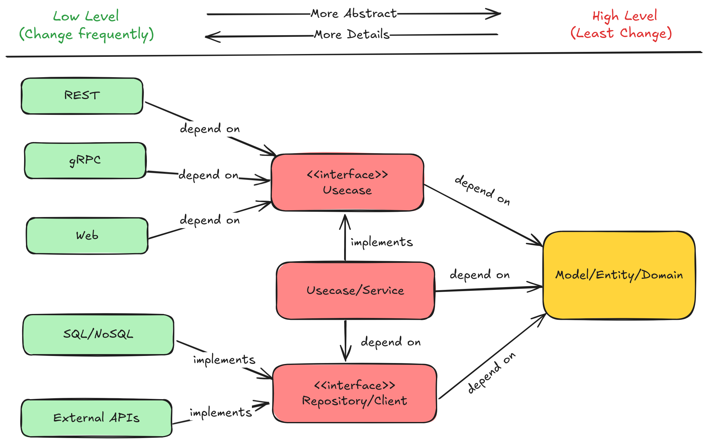

# Go Clean Archx

[](https://goreportcard.com/report/github.com/DucTran999/go-clean-archx)
[](https://github.com/DucTran999/go-clean-archx/actions/workflows/ci.yml)
[](https://golang.org)
[](https://codecov.io/gh/DucTran999/go-clean-archx)
[](LICENSE)

This project is an example implementation of [Clean Architecture](https://8thlight.com/blog/uncle-bob/2012/08/13/the-clean-architecture.html) as proposed by Uncle Bob (Robert C. Martin), demonstrating how to structure a Go application with clear separation of concerns.

---

## 🧠 Architecture Philosophy

[Robert C. Martin (Uncle Bob)](https://8thlight.com/blog/uncle-bob/2012/08/13/the-clean-architecture.html)

- **Independent of Frameworks.** The architecture does not depend on the existence of some library of feature laden software. This allows you to use such frameworks as tools, rather than having to cram your system into their limited constraints.
- **Testable.** The business rules can be tested without the UI, Database, Web Server, or any other external element.
- **Independent of UI.** The UI can change easily, without changing the rest of the system. A Web UI could be replaced with a console UI, for example, without changing the business rules.
- **Independent of Database.** You can swap out Oracle or SQL Server, for Mongo, BigTable, CouchDB, or something else. Your business rules are not bound to the database.
- **Independent of any external agency.** In fact your business rules simply don’t know anything at all about the outside world.”

---

## 👨‍💻 My Thoughts

- **Clean Architecture = separation of concerns + dependency inversion**

---

## 🧭 The Diagram



---

## 📁 Project Structure

```sh
go-clean-archx/
├── .github/workflows/     # GitHub Actions CI
│
├── cmd/                   # App entry point (DI container, HTTP server)
├── internal/
│   ├── controller/        # HTTP handlers (Gin)
│   ├── usecase/           # Business logic
│   ├── entity/            # Domain models and rules
│   ├── repository/        # Database adapters (e.g. GORM)
│   └── port/              # Interfaces between layers
│
├── configs/               # Config files (env, yaml)
├── test/                  # Test data, mocks, builders, coverage
│
├── Makefile               # Developer commands
├── go.mod                 # Go module definition
└── README.md              # Project documentation
```

## ⚙️ Prerequisites

Before you begin, ensure the following tools are installed on your system:

- [**Go 1.21+**](https://go.dev/doc/install) – Required to build and run the application
- [**Docker**](https://docs.docker.com/get-docker/) – Used to run PostgreSQL and Redis locally
- [**make**](https://www.gnu.org/software/make/) – For running predefined developer commands (via `Makefile`)

---

## 🚀 Getting Started

### 1. Clone and setup environment

```bash
git clone https://github.com/DucTran999/go-clean-archx.git
cd go-clean-archx
cp .env.example .env
```

### 2. Start up local env with docker compose

```bash
make up
```

### 3. Run the application

```bash
make run
```

## 🧪 Running Tests

This project uses table-driven tests with mocks for unit testing.

```bash
make unit_test
```

Check code coverage (must run after **make unit_test**)

```bash
make codecov
```

## 📝 License

This project is licensed under the terms of the [MIT License](./LICENSE).

---
